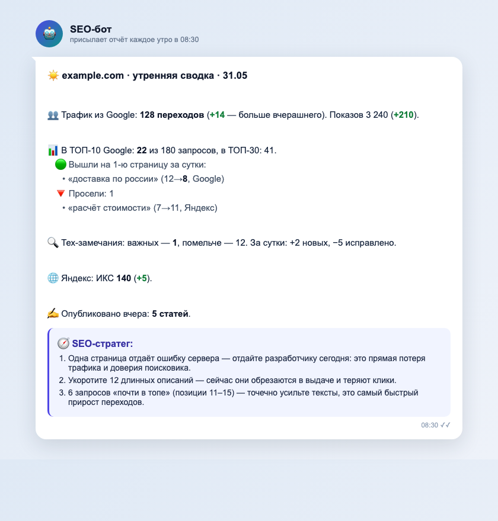

# SEO-завод · стартовый шаблон

[](LICENSE)
[](https://github.com/vasin-k-i/seo-factory-starter/generate)
[](#)
[](#)
[](#)
[](#)
[](#)

Автоматический SEO: агенты в GitHub Actions каждое утро присылают в Telegram
короткий понятный отчёт — трафик, позиции, технические ошибки и **что сделать
сегодня** живым языком (через Claude). Плюс контент-фабрика, которая сама пишет
статьи в блог, и пинги быстрой индексации.

<p align="center">
  
</p>
<p align="center"><sub>Так выглядит утренний отчёт в Telegram. Данные на скриншоте обезличены (example.com).</sub></p>

> Подробное «почему так» и стратегия — в сопроводительном PDF-руководстве.
> Этот репозиторий — рабочий код. Жмёте **Use this template**, кладёте ключи,
> и у вас такой же SEO-завод.

---

## Что внутри

```
seo-agent/                 # «мозг» (Python), запускается в GitHub Actions
  orchestrator.py          # единая точка входа: python orchestrator.py <команда>
  modules/                 # M1–M6, дайджест дня, стратег, недельный разбор, клиенты API
  notifiers/               # Telegram + «человеческий язык» (humanize)
  scripts/ping_new_urls.py # пинг переобхода после публикации
content-factory/           # генератор статей (бриф → текст → редактура через Claude)
  prompts/                 # ШАБЛОНЫ промптов — адаптируйте под свою нишу
.github/workflows/         # расписания (cron) + ручной запуск
```

| Команда | Что делает | Cron (МСК) |
|---|---|---|
| `orchestrator.py daily` | утренний дайджест + мини-аудит + SEO-стратег | ежедневно 08:30 |
| `orchestrator.py m3` | трекинг позиций (Google + Яндекс) | ежедневно 06:00 |
| `orchestrator.py m2` | технический аудит + Core Web Vitals | сб 07:00 |
| `orchestrator.py m1` | семантика → темы для фабрики | вс 04:00 |
| `orchestrator.py digest` | недельный разбор | пн 11:00 |
| контент-фабрика | 5 статей/день (Batch API, −50%) | ежедневно 09:00 |

---

## Быстрый старт (5 минут с Claude Code)

1. **Use this template** → создайте репозиторий из этого шаблона (или склонируйте).
2. Откройте папку репозитория в **Claude Code** и вставьте промпт ниже.
3. Claude по очереди спросит ключи, положит их в GitHub Secrets, настроит домен и проверит доступы. Больше ничего вводить не нужно.

````text
Подними SEO-завод в этом репозитории. Действуй так:

1. Определи репозиторий (gh repo view --json nameWithOwner) и спроси у меня
   домен сайта. Пропиши в .github/workflows/seo-*.yml и content-factory.yml:
     GSC_SITE_URL=sc-domain:<домен>, SEO_SITE_DOMAIN=<домен>,
     M2_SITE_ROOT=https://<домен>

2. Запроси у меня ПО ОЧЕРЕДИ и положи в GitHub Secrets через
   `gh secret set <ИМЯ>` (значения в логи не выводи):
     ANTHROPIC_API_KEY, GSC_OAUTH_CLIENT_ID, GSC_OAUTH_CLIENT_SECRET,
     GSC_OAUTH_REFRESH_TOKEN, YANDEX_WEBMASTER_TOKEN, PSI_API_KEY,
     TELEGRAM_BOT_TOKEN, TELEGRAM_CHAT_ID
     (опционально — позиции Яндекса: TOPVISOR_API_TOKEN, TOPVISOR_USER_ID,
      TOPVISOR_PROJECT_ID; индексация: INDEXNOW_KEY)

3. Если у меня ещё нет GSC refresh-токена — проведи через
   seo-agent/modules/gsc_oauth_setup.py (интерактивный вход в Google).
   Напомни опубликовать OAuth-приложение в Production, иначе токен
   протухнет через 7 дней.

4. Проверь доступы живыми запросами (gsc_client, yandex_webmaster, telegram)
   и запусти dry-run: `cd seo-agent && python3 orchestrator.py daily --dry-run`.
   Покажи результат. Если зелёное — расписания уже работают, отчёты пойдут утром.
````

---

## Ключи и где их взять

| Секрет | Зачем | Где взять |
|---|---|---|
| `ANTHROPIC_API_KEY` | Claude: стратег, M1, тексты | console.anthropic.com |
| `GSC_OAUTH_CLIENT_ID/SECRET/REFRESH_TOKEN` | Google Search Console | Google Cloud Console → OAuth Client; refresh-токен — `gsc_oauth_setup.py` |
| `YANDEX_WEBMASTER_TOKEN` | Яндекс.Вебмастер | OAuth Яндекса (scope webmaster:hostinfo,verify) |
| `PSI_API_KEY` | PageSpeed / Core Web Vitals | Google Cloud Console → PageSpeed Insights API |
| `TELEGRAM_BOT_TOKEN` / `TELEGRAM_CHAT_ID` | доставка отчётов | @BotFather; chat_id — @userinfobot |
| `TOPVISOR_*` *(опц.)* | позиции в Яндексе | topvisor.com → Настройки → API |
| `INDEXNOW_KEY` *(опц.)* | быстрая индексация | сгенерируйте ключ, положите в `public/<key>.txt` |

Per-сайт (в workflow, не секреты): `GSC_SITE_URL`, `SEO_SITE_DOMAIN`, `M2_SITE_ROOT`.

---

## Важно

- **Агенты работают в GitHub Actions, а не на сервере сайта** — так задумано: Claude API недоступен с некоторых регионов, а раннеры GitHub в США/ЕС.
- **Один аккаунт — все сайты.** Токены Google/Яндекс/Anthropic/Telegram привязаны к аккаунту, переиспользуются на нескольких проектах — меняется только домен.
- **URL только латиницей.** Кириллица в слагах ломает маршрут и sitemap.
- **Контент-фабрика и промпты `content-factory/prompts/` — это ШАБЛОНЫ.** Перед запуском адаптируйте их под свою нишу, бренд и стиль. AI-тексты публикуйте только после проверки фактов.
- **Никогда не коммитьте `.env` и `secrets/`** — они в `.gitignore`. В репозиторий идут только `*.example`.

## Лицензия
MIT — см. `LICENSE`. Используйте свободно.
